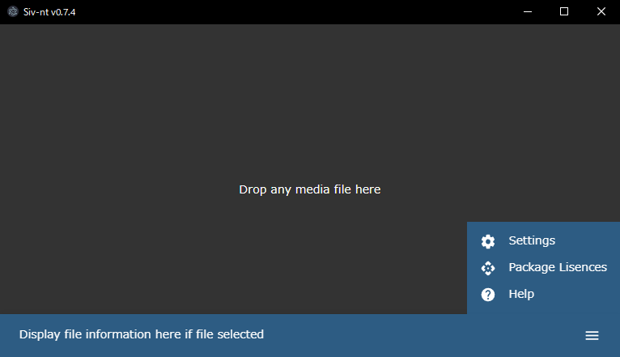

# Siv-nt
Simple image viewer - nextron

# Features

- supported image type: jpg, png, gif, webp, avif
- execute view image in image file association
- Show image in drop image file to window
- show image information (file path, file size, image size(w x h))
- toggle visibility to file info bar on click
- change zoom level when mouse wheel (min 10% - max 1000%)
- switch the image size between original size and window size by holding down the mouse right button and left clicking
- move image position when mouse left button dragging
- move first position to image when mouse left button double click
- if exist other image in the same directory when image dropped, change show image next/prev when click window left/right
- support multiple image drops (in this case, only show drop images and not show same directory images)

- output log data to file
- log file auto remove (max 512 files or 1 month)
- save window position and size and restore
- can change the supported image type
- can change the image movable speed

log file is %APPDATA%/Roaming/Siv-nt/logs/(date)-main.log  
settings.yml is %APPDATA%/Roaming/Siv-nt/settings.yml  

# 機能

- 対応する画像の種類: jpg、png、gif、webp、avif
- 画像ファイルの関連付けから画像を表示して起動
- ウィンドウに画像ファイルをドロップして画像を表示
- 画像の情報の表示（ファイルパス、ファイルサイズ、画像サイズ（縦横））
- クリックで画像情報表示バーの表示/非表示を切り替え
- ホイール上下でズームレベルを変更（最小10％～最大1000％）
- マウス右ボタンを押しながら左クリックで画像のサイズを原寸とウィンドウサイズで切り替え
- マウス左ボタンのドラッグで画像を移動
- マウス左ボタンのダブルクリックで画像を初期位置に移動
- ドロップした画像と同じディレクトリに画像があればウィンドウの左右で次へ前への表示切替
- 複数枚の画像ドロップに対応（この場合、ドロップした画像群のみ表示し、同じディレクトリの画像は表示しません）

- ログデータをファイルに出力
- ログファイルの自動削除（512件または一ヶ月）
- ウィンドウの位置、大きさを保存し復元
- 対応画像形式を可変
- 画像の移動を速度を可変

ログデータは %APPDATA%/Roaming/Siv-nt/logs/(日付)-main.log  
settings.ymlは %APPDATA%/Roaming/Siv-nt/settings.yml  

# Release Plan

In no particular order
- [ ] v0.13.0 image color adjust
- [ ] v0.12.0 image paste from clipboard
- [ ] v0.11.0 image convert and save
- [ ] v0.10.0 support audio file
- [ ] v0.9.0 support movie file
- [ ] v0.8.5 keep image ratio to show next/prev image
- [ ] v0.8.4 add some settings in settings dialog
- [x] v0.8.3 fix show error in app close when dir loading
- [x] v0.8.2 adjust loading progress
- [x] v0.8.1 open files in same directory to open association
- [x] v0.8.0 change next or prev file in same directory

more old versions

- [x] v0.7.4 change default font to Assistant
- [x] v0.7.3 change zoom level ratio in settings dialog
- [x] v0.7.2 adjust env loading with default values
- [x] v0.7.1 change filled help icon in menu bar
- [x] v0.7.0 add settings dialog
- [x] v0.6.12 select log output in production build
- [x] v0.6.11 add version information to help dialog
- [x] v0.6.10 display package licenses for using
- [x] v0.6.9 display mouse control help
- [x] v0.6.8 fixed can't open file association
- [x] v0.6.7 display zoom level and rename file info to display info
- [x] v0.6.6 do not change image size smaller than window when both clicks
- [x] v0.6.5 add accepted types and mouse move ratio in settings.yml
- [x] v0.6.4 could not open due to file association
- [x] v0.6.3 save file info bar active state
- [x] v0.6.2 fix image position move speed
- [x] v0.6.1 save window size
- [x] v0.6.0 zoom in out, move zoom in image  
- [x] v0.5.0 toggle file info bar on click  
- [x] v0.4.0 open image from file association
- [x] v0.3.1 add logger for main process in build application  
- [x] v0.3.0 view image size  
- [x] v0.2.0 view file path, file size  
- [x] v0.1.0 show image  

If I feel like it

- [ ] v?.?.? adjust image position move speed (split horizontal and vertical)
- [ ] v?.?.? send main process from renderer process logging data
- [ ] v?.?.? correct application menu bar
- [ ] v?.?.? display 2 images at the same time
- [ ] v?.?.? invert image up/down when mouse up/down from settings
- [ ] v?.?.? invert zoom in/out when mouse wheel up/down from settings
- [ ] v?.?.? Directory viewer
- [ ] v?.?.? auto release in GitHub Actions
- [ ] v?.?.? multilingual (jp, en)
- [ ] v?.?.? auto updater
- [ ] v?.?.? signing application
- [ ] v?.?.? custom theme

